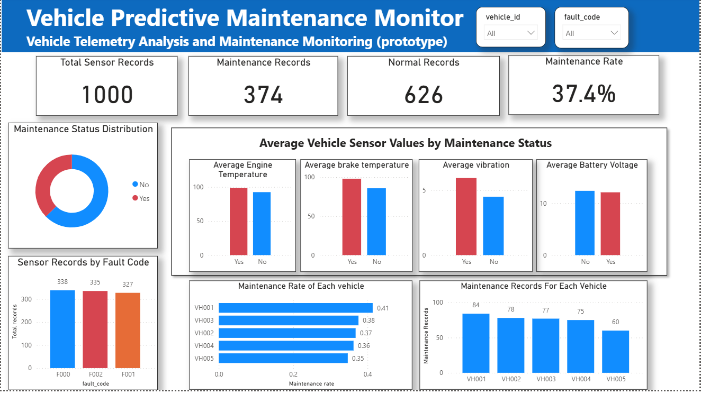

 # Vehicle-predictive-maintenance

---

 ## 1. Project Overview

Vehicle-predictive-maintenance is a prototype project for a critical problem faced by many vehicle owners/drivers which sometimes may cost huge money and may also lead to accidents.

The main issue which this project is trying to solve is predicting maintenance of a vehicle before a simple issue turn into a major issue which can cause a huge impact later based on historical/stimulated data.

---
## 2.Business Problem

A vehicle can develop a problem before the driver or the maintenance team realize that a vehicle is developing.

So, the actual business problem is "Which vehicles are likely to require maintenance so that my team can inspect them before a serious failure occurs?"

---
## 3. Objective

The objective is to identify whether a vehicle may require maintenance before it breakdown and cause trouble for the driver or the maintenance team to identify the issue.

To avoid the following impacts by a delay -
- vehicle downtime
- Unexpected repair costs
- Operational delays
- Safety concerns
- Lost productivity

---
## 4. Proposed Solution

The proposed solution is to extract data collected from vehicle sensors in a structured format then clean and validate the data using python and then use relavent sensor readings to predict whether the maintenance may be required.

---
## 5. Dataset

This project uses simulated vehicle sensor data generated using Python.

The dataset represents structured vehicle telemetry containing parameters such as engine temperature, battery voltage, vibration, brake temperature, speed, mileage, fault codes, and maintenance status.

The data was generated with predefined conditions to create a maintenance-required label. The dataset is used to demonstrate the complete predictive maintenance workflow.

> Note: The dataset is simulated and does not represent real-world vehicle telemetry.

---
## 6. Data Processing

The generated vehicle sensor data was processed using Python, Pandas, and NumPy.

The data was inspected for:

- Missing values
- Duplicate records
- Data types
- Invalid or unexpected categorical values

The timestamp field was converted to datetime for analysis.

Basic filtering, sorting, grouping, numerical analysis, and exploratory analysis were also performed.

The processed dataset was saved separately from the raw dataset.

### Data Processing Output

`data/processed/vehicle_sensor_data_cleaned.csv`

---
## 7. Exploratory Data Analysis

Basic exploratory analysis was performed to understand the relationship between vehicle sensor readings and maintenance requirements.

The analysis showed that observations labelled as requiring maintenance generally had:

- Higher engine temperature
- Higher vibration
- Higher brake temperature
- Slightly lower battery voltage

These observations will be considered when selecting features for the machine learning stage.

---
## 8. SQL and Database

The processed dataset was imported into MySQL for structured storage and analysis.

A database named `vehicle_maintenance_db` was created with a `vehicle_sensor_data` table.

SQL was used for:

- Data validation
- Record and NULL checks
- Duplicate detection
- Category validation
- Vehicle-level analysis
- Maintenance analysis
- Fault-code analysis
- ML data extraction

The SQL scripts are organized in the `sql/` directory based on their purpose.

---
## 9. Machine Learning

The project uses supervised machine learning to predict whether vehicle maintenance may be required.

### Problem Type

Binary classification.

### Target

`maintenance_required`

- `0` → No
- `1` → Yes

### Model

A Random Forest Classifier was used as the initial model.

The workflow includes:

1. Feature and target selection
2. One-hot encoding of `fault_code`
3. Train/test split
4. Model training
5. Prediction
6. Model evaluation
7. Feature-importance analysis

The trained model is saved in:

`src/ml/vehicle_maintenance_model.pkl`

> Note: The current model is trained on simulated data. Its performance should not be considered representative of a real-world predictive maintenance system.

## 10. AWS Cloud Integration

The project includes a small AWS workflow to demonstrate cloud storage, event-driven processing, serverless execution, and monitoring.

### AWS Architecture

```text
Vehicle Sensor CSV
        ↓
Amazon S3
        ↓
S3 Event Trigger
        ↓
AWS Lambda
        ↓
CSV Processing
        ↓
Maintenance Evaluation
        ↓
CloudWatch Logs

## 11. Power BI Dashboard

Power BI was used as the business-facing visualization layer of the project.

The processed vehicle sensor data was connected to Power BI to create an interactive dashboard for vehicle maintenance monitoring.

The dashboard includes:

- Total sensor records
- Maintenance records
- Normal records
- Maintenance rate
- Maintenance status distribution
- Average sensor values by maintenance status
- Sensor records by fault code
- Maintenance rate by vehicle
- Maintenance records by vehicle

Interactive slicers allow users to filter the dashboard by vehicle ID and fault code.

### Dashboard Preview



## 12. End-to-End Workflow

```text
                        Simulated Vehicle Sensor Data
                                |
                                v
                        Python Data Generation
                                |
                                v
                        Pandas / NumPy Processing
                                |
                                +----------------------+
                                |                      |
                                v                      v
                                MySQL              Random Forest ML
                                |                      |
                                v                      v
                        SQL Analysis             Prediction
                                |                      |
                                +----------+-----------+
                                        |
                                        v
                                        Power BI
                                        |
                                        v
                                Interactive Dashboard


                        Cloud Processing Workflow

                        Vehicle Sensor CSV
                                |
                                v
                        Amazon S3
                                |
                        S3 Event Trigger
                                |
                                v
                        Lambda
                                |
                                v
                        CSV Processing
                                |
                                v
                        CloudWatch Logs


## 13 Limitations
- The vehicle dataset is simulated rather than collected from real vehicle telemetry.
- Maintenance labels were generated using predefined conditions.
- The current machine-learning model therefore does not represent real-world predictive performance.
- The AWS Lambda component demonstrates lightweight event-driven processing and does not currently host the - complete Scikit-learn model.
- The prototype does not directly connect to vehicle sensors, ECU, OBD systems, or telematics devices.
- The current dataset contains a relatively small number of vehicles compared with a production fleet.

## 14 Future Improvements

A production-oriented version could include:

- Real vehicle telemetry and historical maintenance records
- More comprehensive data validation
- Additional feature engineering
- Stronger model validation using real-world data
- Model versioning and monitoring
- Scalable cloud-based inference
- Integration with an analytical database or data warehouse
- Automated maintenance alerts
- Fleet-level drill-through and reporting
- Real-time or scheduled data ingestion