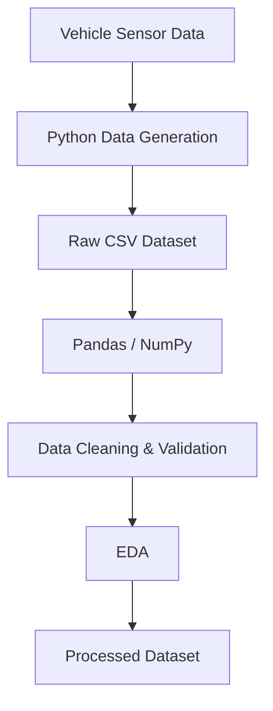
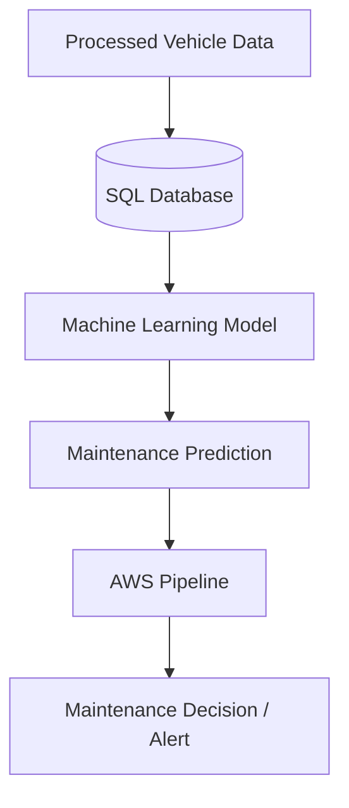

 # Project Architecture

## Current Workflow

```mermaid
flowchart TD
    A[Vehicle Sensor Data] --> B[Python Data Generation]
    B --> C[Raw CSV Dataset]
    C --> D[Pandas / NumPy]
    D --> E[Data Cleaning & Validation]
    E --> F[EDA]
    F --> G[Processed Dataset]
```

---

## Planned Workflow

```mermaid
flowchart TD
    A[Processed Vehicle Data] --> B[(SQL Database)]
    B --> C[Machine Learning Model]
    C --> D[Maintenance Prediction]
    D --> E[AWS Pipeline]
    E --> F[Maintenance Decision / Alert]
```
