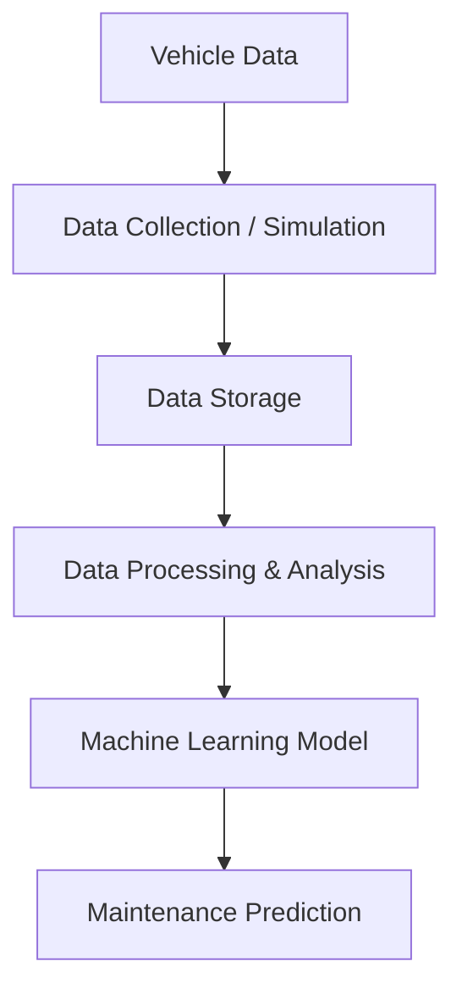

#Project - vehicle-predictive-maintenance

##Problem statement
- Unexpected vehicle breakdowns can cause downtime, repair costs, and operational disruptions. The goal of this project is to explore whether vehicle telemetry and maintenance-related data can be used to identify potential maintenance requirements before a failure occurs.

---
##Why predictive maintenance matters
- Traditional maintenance is often:

- Reactive — repair after a failure
- Preventive — service at predefined intervals

- Predictive maintenance aims to use data to identify early warning signals, potentially helping organizations plan maintenance before unexpected failures occur.

---
##Who would use the system
- Potential users include:

- Fleet operators — monitor multiple vehicles
- Maintenance teams — prioritize vehicles requiring attention
- Logistics companies — reduce vehicle downtime
- Automotive service providers — identify potential maintenance needs

---
##What data could be collected
- A real-world system could receive data from vehicle sensors, ECU/OBD systems, or telematics devices, such as:

- Engine temperature
- Battery voltage
- Engine RPM
- Vehicle speed
- Mileage
- Vibration
- Brake temperature
- Fuel consumption
- Fault/error codes
- Maintenance history

---
##Proposed solution
- Build an end-to-end prototype that:

- The initial dataset will be generated using Python, processed using Pandas/NumPy, and later used to develop a machine-learning model for maintenance prediction.

---
##Expected output
- The system should provide a simple prediction such as: Maintenance Required: Yes / No

- The project can later be extended to provide a maintenance risk score or additional insights based on vehicle conditions.

---
##Current limitations
- The current dataset is simulated, not collected from real vehicles.
- Maintenance labels are initially generated using predefined rules.
- The prototype does not directly connect to vehicle sensors or OBD devices.
- Model performance will depend on the quality and representativeness of the dataset.
- This is a learning/prototype project, not a production vehicle-diagnostics system.
